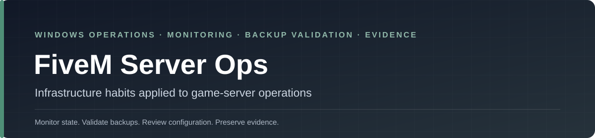

<p align="center">
  
</p>

<p align="center">
  <a href="https://github.com/dschunk/fivem-server-ops/actions/workflows/validate-powershell.yml"></a>
  <a href="LICENSE"></a>
</p>

# FiveM Server Ops

A focused Windows operations toolkit for FiveM server owners who want the same habits that matter in ordinary infrastructure: **monitoring, validated backups, configuration review, logging, inventory, status reporting, and visible failure**.

This is intentionally an **operations project**, not a gameplay framework, resource pack, or server distribution.

> The interesting part is not FiveM. The interesting part is applying production-minded operational discipline to a small Windows-hosted service.

## Start with the operational question

| Question | Tool |
|---|---|
| Is the game service and txAdmin reachable? | `Test-FiveMEndpoint.ps1` |
| Is the configuration safe to commit or deploy? | `Test-FiveMConfig.ps1` |
| What resources are installed? | `Get-FiveMResourceInventory.ps1` |
| What is the current public server state? | `Get-FiveMServerStatus.ps1` |
| Did anything change in the resource set? | `Compare-FiveMResourceSnapshot.ps1` |
| Is the backup archive actually readable and complete? | `Test-FiveMBackup.ps1` |
| What is happening in recent logs? | `Get-FiveMLogSummary.ps1` |
| Are expected ports reachable? | `Test-FiveMPortMatrix.ps1` |
| Did the process state change? | `Watch-FiveMProcess.ps1` |
| Can I publish a sanitized status payload? | `Export-FiveMStatusPage.ps1` |

## Example operational workflow

```powershell
# 1. Check reachability
.\Test-FiveMEndpoint.ps1 -HostName 127.0.0.1 -GamePort 30120 -TxAdminPort 40120

# 2. Review configuration before deployment
.\Test-FiveMConfig.ps1 -Path C:\FiveM\server-data\server.cfg

# 3. Inventory what is installed
.\Get-FiveMResourceInventory.ps1 -ResourcesPath C:\FiveM\server-data\resources

# 4. Create a backup
.\Backup-FiveMServer.ps1 `
    -SourcePath C:\FiveM\server-data `
    -DestinationPath D:\Backups\FiveM `
    -RetentionDays 14

# 5. Validate the backup instead of trusting the job result
.\Test-FiveMBackup.ps1 -ArchivePath D:\Backups\fivem-latest.zip

# 6. Summarize recent operational noise
.\Get-FiveMLogSummary.ps1 -Path C:\FiveM\logs\server.log
```

## What this project teaches beyond FiveM

The repo is intentionally useful as a small infrastructure case study.

### Monitoring

Check state repeatedly and make **changes in state** visible. “It is down” is useful; “it changed from healthy to unreachable at 03:14” is better.

### Backup validation

A successful ZIP creation is not proof that the backup is usable. Open the archive, inspect it, hash it, and test restore assumptions.

### Configuration safety

Configuration files often accumulate secrets, duplicate entries, stale resources, and undocumented assumptions. Review them before deployment.

### Inventory

Operators should know what is actually installed, not what somebody remembers installing.

### Logging

Logs need classification and summarization before they become useful evidence.

### Public status

Status output must be sanitized. Internal hostnames, private paths, administrative ports, credentials, and infrastructure details do not belong in a public feed.

## Operational rules

- **Do not store server keys or webhook URLs in source control.** Use environment variables or another protected secret store.
- **A successful backup job is not proof of recoverability.** Validate archives and test restores.
- **Do not expose txAdmin directly to the public internet without appropriate access controls.**
- **Monitor state changes, not just current state.**
- **Sanitize public status data.**
- **Collect before changing.** Logs and configuration snapshots are easiest to interpret before experimentation begins.

## Quality gates

Every push and pull request is parsed on a Windows runner and checked with PSScriptAnalyzer error rules.

[](https://github.com/dschunk/fivem-server-ops/actions/workflows/validate-powershell.yml)

## Classroom / lab use

This repository can be useful in PowerShell, Windows administration, or operations courses because it is small enough to understand end-to-end.

Possible exercises:

- add structured error handling to one collector;
- compare “backup completed” with “backup validated”;
- create a synthetic resource snapshot and detect changes;
- design a sanitized public status schema;
- classify log lines into operational categories;
- explain which details should never be exposed publicly;
- extend a script while preserving safe defaults and structured output.

For broader course material, see the [Teaching & Classroom Guide](https://github.com/dschunk/dschunk/blob/main/docs/CLASSROOM.md).

## Security and project boundary

This repository is maintained in a personal capacity and is not affiliated with, sponsored by, or endorsed by any current or former employer.

Do not contribute:

- employer confidential or proprietary information;
- production credentials or server keys;
- private webhook URLs;
- private infrastructure inventories;
- customer data;
- internal-only configurations.

Examples should use personal/community infrastructure or generic test data.

## Related engineering work

- [Windows IT Toolkit / SchunkOps](https://github.com/dschunk/windows-it-toolkit) — general Windows and infrastructure operations tooling
- [Infrastructure Dashboard](https://github.com/dschunk/infrastructure-dashboard) — public operations-interface case study
- [Build It Like You Won't Be There Tomorrow](https://github.com/dschunk/build-it-like-you-wont-be-there) — runbooks, monitoring, backup, recovery, and handoff standards
- [Everyday IT Tips](https://everydayittips.com/) — practical Windows and infrastructure field guides
- [DavidSchunk.com](https://www.davidschunk.com/) — broader portfolio
